# BudgetFlowFusion
    

Authors:
 - Kamil Troszczyński [Github](https://github.com/Kamil-Troszczynski)
 - Wojciech Fiedoruk [Github](https://github.com/Wojtek901)
 - Miłosz Piecha [Github](https://github.com/Coffee4Cat)
 - Dominik Chmielak [Github](https://github.com/Kamil-Troszczynski)
 - Mateusz Bartosiak [Github](https://github.com/barto159)

The purchase records system is a web application designed for managing and monitoring purchase-related data within a student research club. The frontend was built using Vue.js, the backend is based on FastAPI, the data is created in SQL Model and stored in an PostgreSQL database. The system allows users to add, edit, and browse purchase records, providing quick access to information and convenient data management.

## Relational model

[Interactive model (Lucidchart)](https://lucid.app/lucidchart/4c60fae3-d6ca-4e1f-99f1-ca321ef8f68c/edit?viewport_loc=-4019%2C-1542%2C5790%2C3232%2C0_0&invitationId=inv_2f28a81a-1fdf-4abd-bf29-cbbb9eadcab6)

```mermaid
erDiagram
    Association {
        int association_id PK
        varchar association_name
    }

    Project {
        int project_id PK
        varchar project_name
        varchar description
        float allocated_budget
        float rest_of_budget
        int association_id FK
    }

    AssociationBudget {
        int association_budget_id PK
        varchar association_budget_name
        float total_budget
        float spent_money
        int public_purchase_plan_list_id FK
    }

    ProjectBudget {
        int project_budget_id PK
        varchar project_budget_name
        float total_budget
        float spent_money
        int association_budget_id FK
        int project_id FK
    }

    Funding {
        int funding_id PK
        varchar funding_name
        varchar organizer
        varchar signing_person
        date spending_deadline
        float funding_price
        float spent_money
        int project_id FK
        int project_budget_id FK
        int association_budget_id FK
    }

    FundingTask {
        int funding_task_id PK
        int funding_id FK
        varchar task_name
        float task_budget
    }

    PublicPurchasePlanList {
        int public_purchase_plan_list_id PK
        varchar public_plan_list_name
        int plan_year
        varchar plan_number
        varchar fund_responsible_person
        float euro_exchange_rate
        int funding_id FK
    }

    PublicPurchasePlan {
        int public_purchase_plan_id PK
        varchar public_purchase_plan_name
        varchar cpv_code
        varchar plan_position_number
        float cost
        int funding_id FK
        int gslbccf_id FK
        int public_purchase_plan_list_id FK
    }

    GroupedShopsListByCpvCategoryAndFunding {
        int gslbccf_id PK
        float allocated_money
    }

    PurchaseRequest {
        int purchase_request_id PK
        varchar purchase_request_name
        float budget_allocated_for_the_order
        boolean if_service
        varchar used_cpv_id
        datetime created_at
        boolean can_add
        varchar document_request_name
        date contract_value_date
        float euro_exchange_rate
        varchar main_cpv_code
        float final_net_total
        float final_gross_total
        varchar finalization_status
        datetime finalized_at
        varchar plan_exception_justification
        varchar plan_compliance_status
        int project_budget_id FK
        int funding_id FK
        int public_purchase_plan_id FK
        int gslbccf_id FK
        int project_finance_manager_id FK
    }

    PurchaseRequestFinalizationSnapshot {
        int snapshot_id PK
        int purchase_request_id FK
        int shop_purchase_list_id FK
        int public_purchase_plan_id FK
        int funding_id FK
        varchar shop_name
        varchar funding_name
        varchar plan_name
        varchar plan_number
        varchar fund_responsible_person
        varchar plan_position_number
        varchar cpv_code
        float planned_net_amount
        float allocated_net_amount
        float allocated_eur_amount
        float allocated_gross_amount
        boolean is_main_cpv
        datetime created_at
    }

    PurchaseRequestSettlementLine {
        int settlement_line_id PK
        int purchase_request_id FK
        int shop_purchase_list_id FK
        int invoice_id FK
        varchar shop_name
        varchar purchase_description
        float planned_gross_amount
        float actual_gross_amount
        boolean is_extra
        datetime created_at
        datetime updated_at
    }

    PurchaseRequestFundingAllocation {
        int purchase_request_id PK "FK"
        int funding_id PK "FK"
        float allocated_amount
    }

    PurchaseRequestPlanPosition {
        int purchase_request_id PK "FK"
        int shop_purchase_list_id PK "FK"
        int public_purchase_plan_id PK "FK"
        float allocated_amount
    }

    Settlement {
        int settlement_id PK
        datetime created_at
        int paid_by_project_finance_manager_id FK
        int purchase_request_id FK
    }

    Invoice {
        int invoice_id PK
        varchar number
        date issue_date
        varchar seller_name
        varchar seller_nip
        float net_total
        float vat_total
        varchar status
        datetime created_at
        int settlement_id FK
        int project_finance_manager_id FK
    }

    ProjectFinanceManager {
        int project_finance_manager_id PK
        varchar login
        varchar password_hash
        boolean access
    }

    Student {
        int student_id PK
        varchar name
        varchar surname
        varchar login
        varchar password_hash
        varchar position
        boolean is_in_sap
        int project_finance_manager_id FK
        int association_id FK
    }

    Shop {
        int shop_id PK
        varchar shop_name
        varchar link
        varchar opinion
        varchar status
        int created_by_student_id
        varchar address
        datetime delivery_time
        boolean is_recommended
        float free_delivery_threshold
    }

    Item {
        int item_id PK
        varchar name
        float price
        varchar currency
        varchar link
        datetime created_at
        float tax_rate
        varchar status
        int product_subcategory_id FK
        int student_id FK
        int shop_id FK
    }

    ProductCategory {
        int product_category_id PK
        varchar product_category_name
        varchar description
        varchar cpv
        int shop_purchase_list_id FK
        int public_purchase_plan_id FK
    }

    ProductSubcategory {
        int product_subcategory_id PK
        varchar product_subcategory_name
        varchar description
        int product_category_id FK
    }

    ShopPurchaseList {
        int shop_purchase_list_id PK
        int priority
        varchar name
        float cost
        datetime created_at
        varchar market_research_comment
        varchar market_research_file_name
        int gslbccf_id FK
        int settlement_id FK
        int funding_id FK
        int shop_id FK
        int student_id FK
    }

    ShopPurchaseListItem {
        int shop_purchase_list_id PK "FK"
        int item_id PK "FK"
        int amount
    }

    ShopPurchaseListItemContribution {
        int shop_purchase_list_id PK "FK"
        int item_id PK "FK"
        int student_id PK "FK"
        int amount
        datetime created_at
    }

    Association ||--o{ Project : "has"
    Association ||--o{ Student : "has"

    AssociationBudget ||--o{ ProjectBudget : "contains"
    AssociationBudget ||--o{ Funding : "funds"
    AssociationBudget |o--o| PublicPurchasePlanList : "references"

    Project ||--|| ProjectBudget : "has"
    Project ||--o{ Funding : "receives"

    ProjectBudget ||--o{ PurchaseRequest : "funds"
    ProjectBudget ||--o{ Funding : "has"

    Funding ||--o{ PurchaseRequest : "funds"
    Funding ||--o| PublicPurchasePlanList : "has"
    Funding ||--o{ FundingTask : "has"
    Funding ||--o{ ShopPurchaseList : "funds"
    Funding ||--o{ PublicPurchasePlan : "referenced by"
    Funding ||--o{ PurchaseRequestFundingAllocation : "allocated in"
    Funding ||--o{ PurchaseRequestFinalizationSnapshot : "snapshot"

    PublicPurchasePlanList ||--o{ PublicPurchasePlan : "contains"

    PublicPurchasePlan ||--o{ PurchaseRequest : "covers"
    PublicPurchasePlan ||--o{ ProductCategory : "categorizes"
    PublicPurchasePlan ||--o{ PurchaseRequestPlanPosition : "in"
    PublicPurchasePlan ||--o{ PurchaseRequestFinalizationSnapshot : "snapshot"

    GroupedShopsListByCpvCategoryAndFunding ||--o{ PurchaseRequest : "groups"
    GroupedShopsListByCpvCategoryAndFunding ||--o{ ShopPurchaseList : "groups"
    GroupedShopsListByCpvCategoryAndFunding ||--o{ PublicPurchasePlan : "groups"

    PurchaseRequest ||--o{ Settlement : "settled by"
    PurchaseRequest ||--o{ PurchaseRequestFinalizationSnapshot : "snapshots"
    PurchaseRequest ||--o{ PurchaseRequestSettlementLine : "has"
    PurchaseRequest ||--o{ PurchaseRequestFundingAllocation : "has"
    PurchaseRequest ||--o{ PurchaseRequestPlanPosition : "has"

    Settlement ||--o{ Invoice : "has"
    Settlement ||--o{ ShopPurchaseList : "settles"

    Invoice ||--o{ PurchaseRequestSettlementLine : "referenced by"

    ProjectFinanceManager ||--o{ Settlement : "pays"
    ProjectFinanceManager |o--o| Student : "manages"
    ProjectFinanceManager ||--o{ PurchaseRequest : "approves"
    ProjectFinanceManager ||--o{ Invoice : "handles"

    Student ||--o{ Item : "adds"
    Student ||--o{ ShopPurchaseList : "creates"
    Student ||--o{ ShopPurchaseListItemContribution : "contributes"

    Shop ||--o{ Item : "sells"
    Shop ||--o{ ShopPurchaseList : "in"

    ProductCategory ||--o{ ProductSubcategory : "has"
    ProductSubcategory ||--o{ Item : "classifies"

    ShopPurchaseList ||--o{ ShopPurchaseListItem : "contains"
    ShopPurchaseList ||--o{ ProductCategory : "has"
    ShopPurchaseList ||--o{ PurchaseRequestSettlementLine : "referenced by"
    ShopPurchaseList ||--o{ PurchaseRequestPlanPosition : "in"
    ShopPurchaseList ||--o{ PurchaseRequestFinalizationSnapshot : "snapshot"
    ShopPurchaseList ||--o{ ShopPurchaseListItemContribution : "has"

    Item ||--o{ ShopPurchaseListItem : "in"
    Item ||--o{ ShopPurchaseListItemContribution : "has"
```



## Clone repository

```bash
#   With ssh
git clone git@github.com:Kamil-Troszczynski/BudgetFlowFusion.git

#   With https
git clone https://github.com/Kamil-Troszczynski/BudgetFlowFusion.git
```

## Install & prepare Docker

### On Linux Ubuntu
```bash
# Update
 sudo apt-get update

# Install docker
sudo apt install ./docker-desktop-amd64.deb

# Check whether it's work
systemctl --user start docker-desktop

# Close docker menu
 systemctl --user stop docker-desktop
```

### On Windows
[Go to this site and install Docker for Windows OS](https://www.docker.com/get-started/)


## Install Node.js with npm manager

### On Linux Ubuntu
```bash
# Download and install nvm:
curl -o- https://raw.githubusercontent.com/nvm-sh/nvm/v0.40.4/install.sh | bash

# in lieu of restarting the shell
\. "$HOME/.nvm/nvm.sh"

# Download and install Node.js:
nvm install 24

# Verify the Node.js version:
node -v
# Should print "v24.15.0".

# Verify npm version:
npm -v
# Should print "11.12.1".
```

### On Windows
```bash
# Download and install Chocolatey:
powershell -c "irm https://community.chocolatey.org/install.ps1|iex"

# Download and install Node.js:
choco install nodejs --version="24.15.0"

# Verify the Node.js version:
node -v
# Should print "v24.15.0".

# Verify npm version:
npm -v
# Should print "11.12.1".
```


## How to launch backend with database?

Launch server and database

```bash
#   Go to directory
cd BudgetFlowFusion

#   Launch infrastructure
docker compose up --build

#   In order to reset database, delete volume
docker compose down -v
```

## How to run frontend in dev mode?

```bash
#   Go to frontend directory
cd frontend

#   Install npm manager with packages
npm install

#   Run developer mode
npm run dev
```

## How to build frontend in production mode?

```bash
npm run build
```

## How to look up database?

```bash
docker exec -it budgetflowfusion_db psql -U budgetflowfusion -d budgetflowfusion
```

## How to run tests?

With running container.

```bash
docker exec -it backend python -m pytest tests/
```
